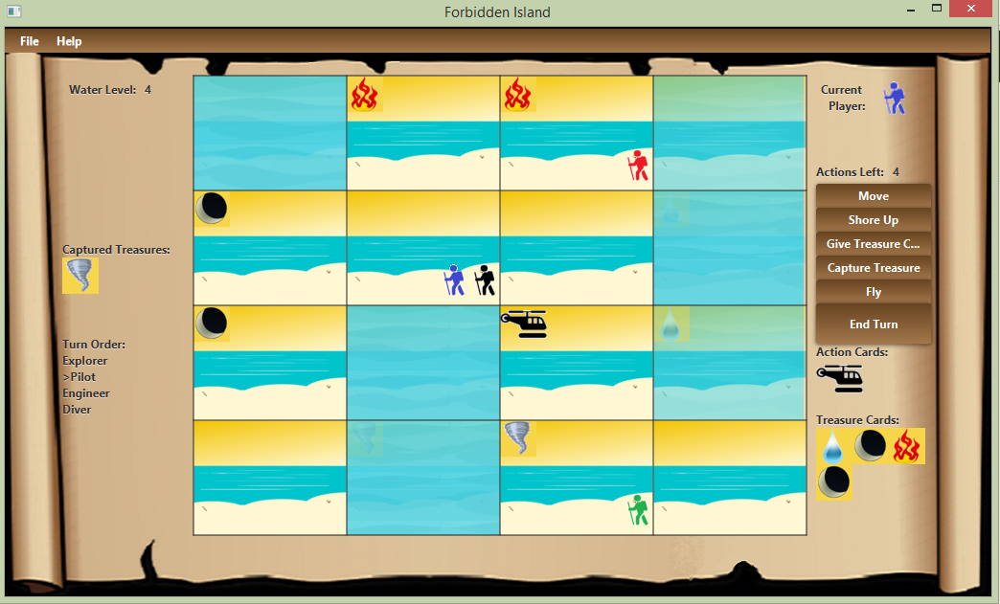

# IslandGame
This is a demo project designed to emulate a popular board game "Forbidden Island" (by Gamewright Inc.).
Logic written in Java with UI written in JavaFX 8.
The goal of the game is for players to move around the island collecting treasures and ultimately escapting by helicopter while various tiles of the island are sinking. See Wikipedia for the game rules: https://en.wikipedia.org/wiki/Forbidden_Island_(game).

